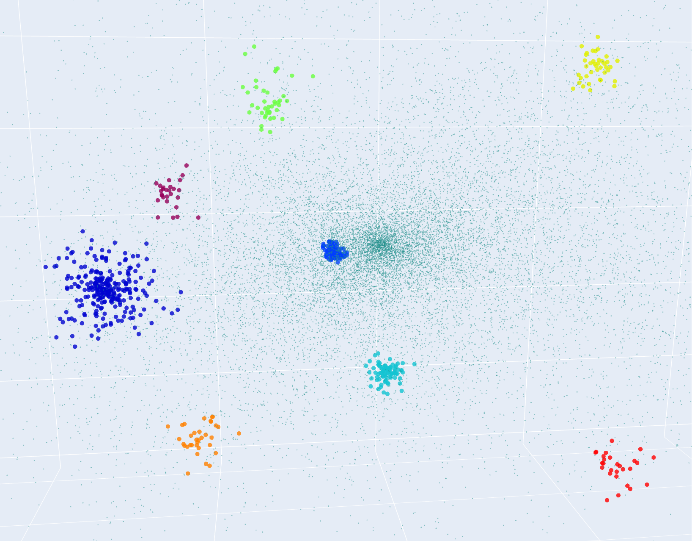
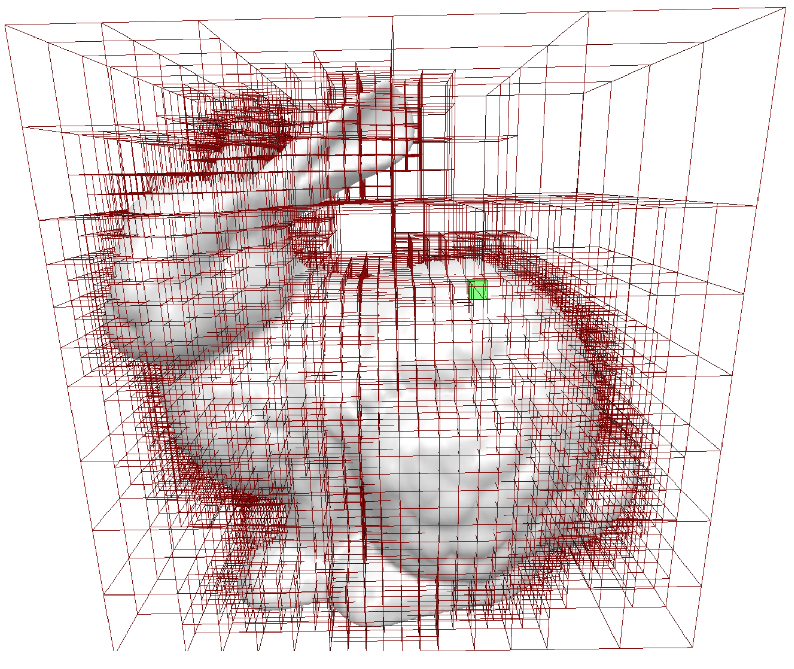
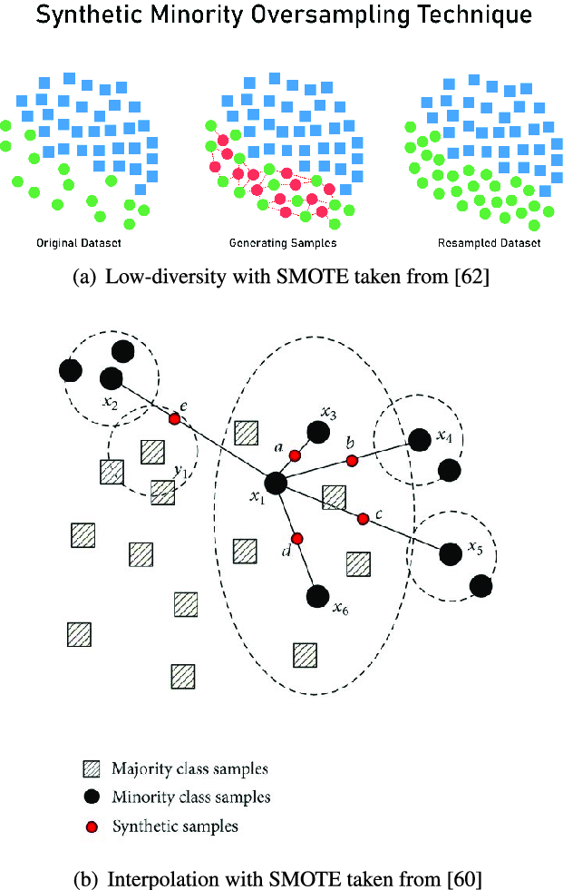
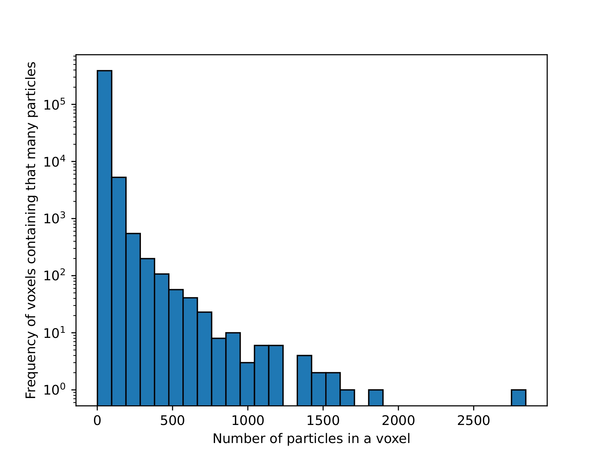
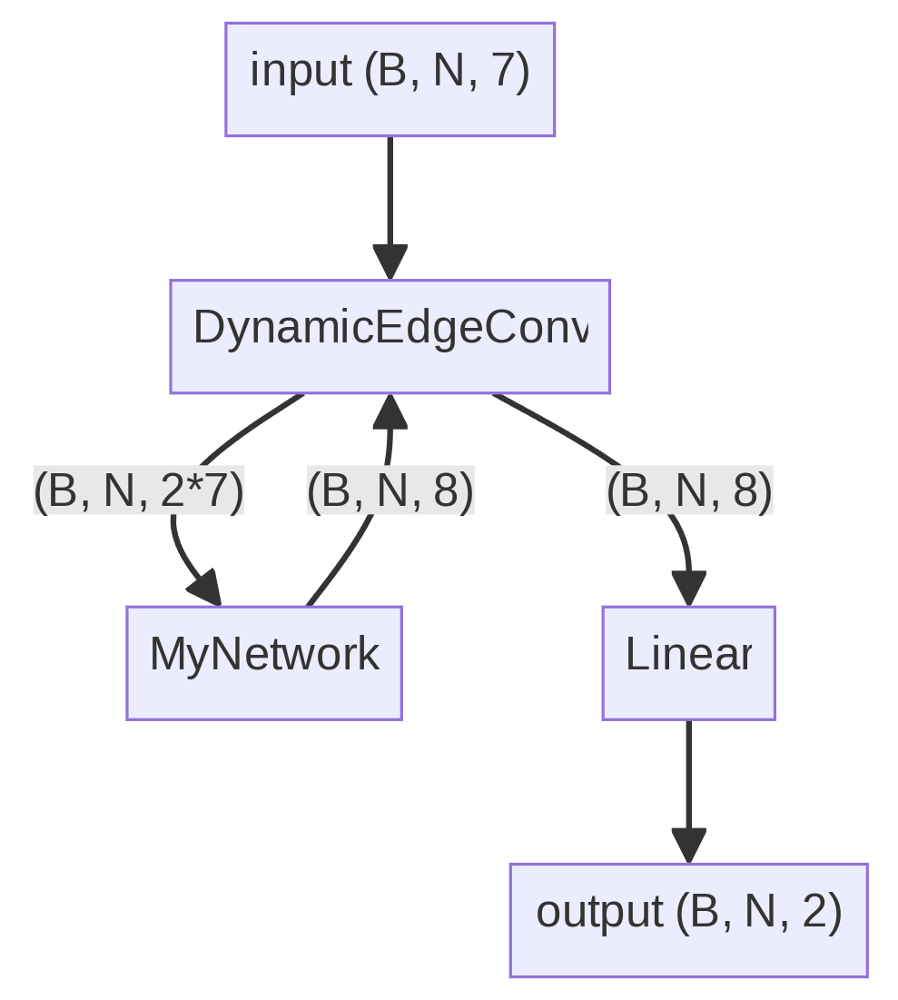
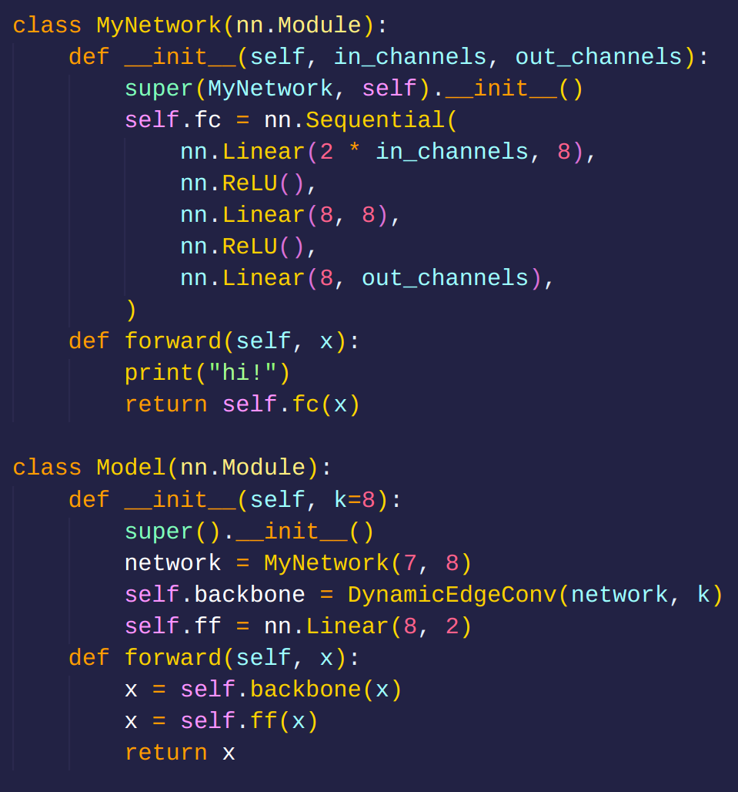
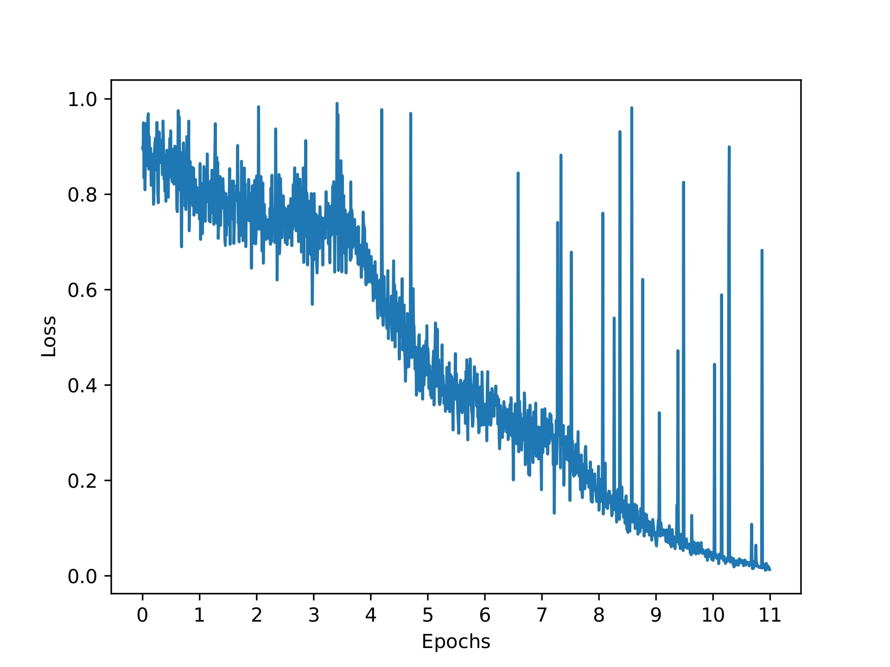
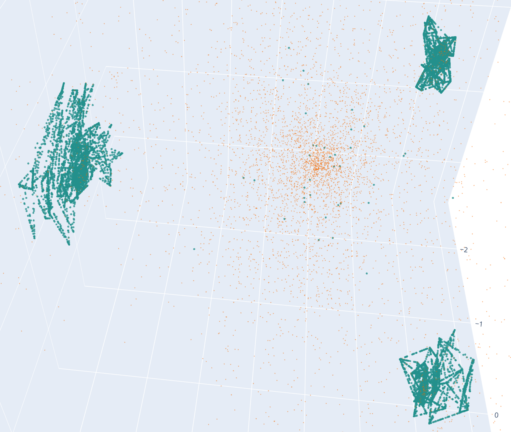

# Deep Halo using GNNs

Aritra Mukhopadhyay

---

## Problem Statement

Given a halo represented as a point cloud, our goal is to:

* **Classify each point**: Determine whether it belongs to a halo or the background.
* **Sub-halo classification**: If it belongs to a halo, differentiate which sub-halo it is a part of.

---

## Problems Faced

While trying to solve this problem we faced a lot of issues, we learned something new and and attempted to solve them.

### Problem 1: Handling Large Datasets using Octree

We had downloaded the smallest dataset available on the site. But even the smallest had $\approx20$ million points in the cloud (which is huge). We had to come up with a way to reduce the number of points without losing much information. **Octree** algorithm came to our rescue.

The idea is to voxelise the space in a clever way such that we get as less number of voxels as possible. We would have dense voxels in the regions where there are a lot of points and sparse voxels in the regions where there are less points.

---

### Octree Algorithm

<!-- First we decide upon two hyperparameters; $N$ and $L$. $N$ is the maximum number of points that can be present in a voxel and $L$ is minimum voxel size to be followed even if there are more than $N$ points in a voxel. -->

* **Step 1**: Divide the space into 8 equal parts.
* **Step 2**: If a part contains less than $N$ points, keep it as it is.
* **Step 2**: If the size of the voxel is less than $L$, keep it as it is.
* **Step 3**: Divide the remaining voxels into 8 equal parts and repeat the process recursively.

Values of $N$ and $L$ are chosen as needed.

---

### Problem 2: Class Imbalance solved using SMOTE

* **Class Imbalance**: The dataset suffered from a significant class imbalance, where the background points greatly outnumbered the foreground (halo) points, leading to biased models that favored the majority class.
* **Consequences**: This imbalance caused models to be less effective in detecting halo points, resulting in poor classification performance and inaccurate results.
* **Solution:** We employed **SMOTE** (Synthetic Minority Over-sampling Technique), a popular oversampling method, to generate additional synthetic samples of the minority class, thereby balancing the class distribution and improving model performance.

---

### SMOTE

* Selecting a Minority Instance
* Finding k-Nearest Neighbors
* Generating Synthetic Samples
* Adding Synthetic Samples
* Repeat untill the desired number of samples are generated

---

## GNNs

Our point cloud data can be thought of as a graph, where each point is a node and the edges are formed by the nearest neighbors. This similarity to instance segmentation on images motivates us to use **Graph Convolution**, a technique inspired by image segmentation.

---

GNNs operate on graph-structured data using three steps:

**Message Passing**
$$m_{A\rightarrow B} = W \cdot h_A + b$$

**Aggregation**
$$a_B = \sum_i^{\text{neighbours of B}} m_{i\rightarrow B}$$

**Update**
$$h_B' = \mathrm{MLP}([h_B, a_B])$$

---

## Dynamic Edge Convolution

Dynamic Edge Convolution (DEC) is a specialized type of Graph Neural Network (GNN) designed to work with point cloud data, which lacks explicit edge information. To overcome this limitation, DEC employs a k-Nearest Neighbors (k-NN) algorithm to dynamically generate edge information from the node features. This allows DEC to construct a graph structure on-the-fly, enabling it to operate on point cloud data. Once the edge information is generated, DEC proceeds normally like a GNN, passing messages between nodes, aggregating them, and updating node features. The output of DEC is a set of node features that capture complex patterns in the point cloud data.

---

## Experiments

### Octree Results

We used $N = 100$ (maximum number of points in a voxel) and $L = 0.001$ (minimum voxel size WRT simulation box size).

* Total number of voxels: 395286 ($\approx2\%$ of $2\times10^7$)
* Number of voxels with less than 100 particles: 388990 (98.4\%)

---

<!-- 
 -->

---

## Details of the experiment:

* **Optimizer**: Stochastic Gradient Descent (SGD) with learning rate 0.01, momentum 0.9, and weight decay 0.0001.
* Loss function: Binary-Cross-entropy loss.
* Smote was used to balance the classes.

---

## Results

<!--  -->

<!-- center the image and preserve aspect ratio -->

---

Thank you!